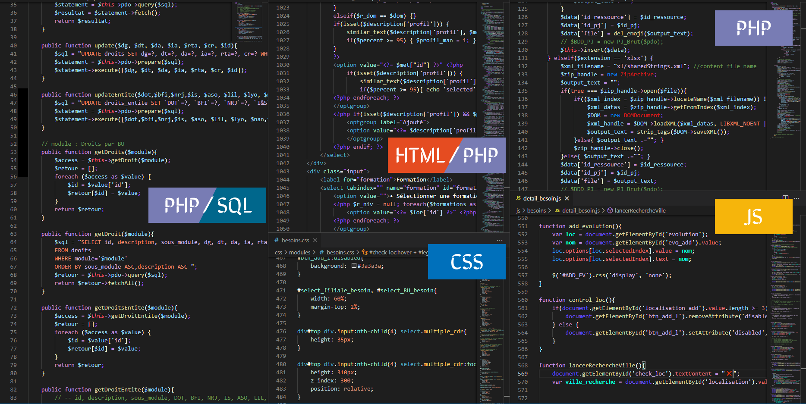

# README
## ElemkahDark - Theme
Dark theme with slightly vivid colors for a harmonious mixture making it easier to spot each element making up your code.

* Dark base theme
* Enhance differenciation of languages (SQL / PHP / CSS / JS ...)
* Optimize for be fast
* No more ... But good :)

### For more information or contribute
* [GitHub elemkahtheme_vsc](https://github.com/Elemkah/elemkahtheme_vsc)

**Enjoy 😆, any request go to github !**